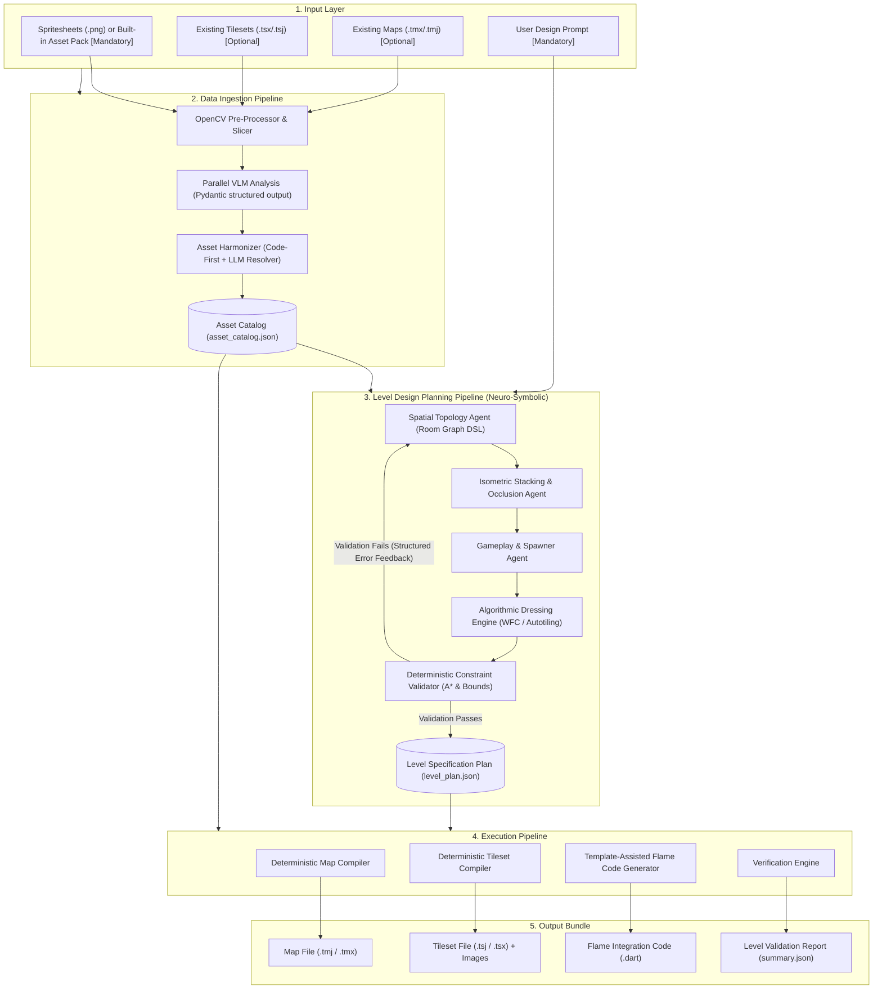
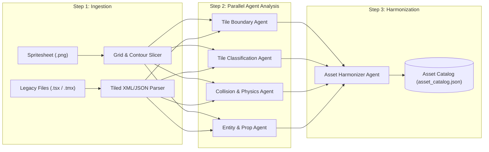
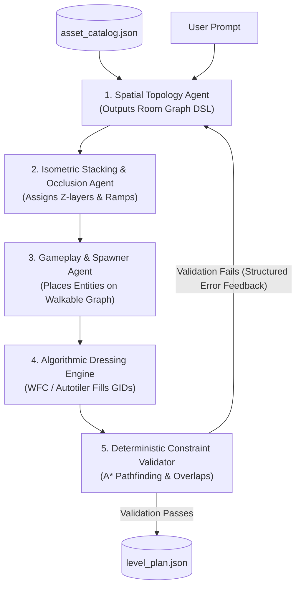
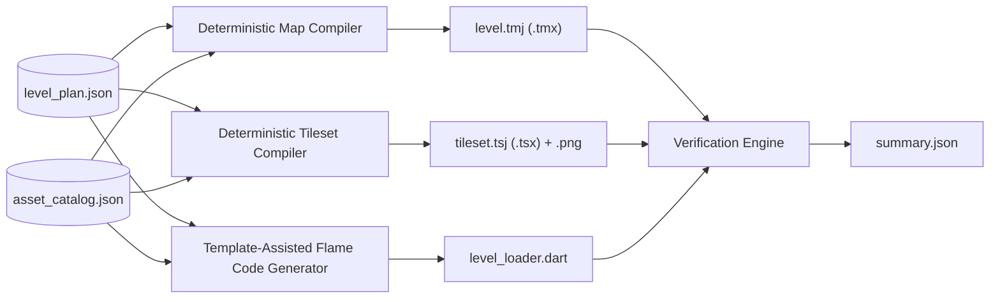

# System Architecture: AI-Assisted 2D Isometric Level Generator for Flame Engine

## 1. Purpose and Scope

This document specifies the production architecture for an automated level design system. 
The system generates 2D isometric game levels for the Flame game engine. 
The system converts input assets and design prompts into game-ready map files and Dart source code.

### 1.1 Core Objectives
* Remove manual level layout work in Tiled Map Editor.
* Accept raw spritesheets as the primary asset input.
* Prevent low-quality output through rigorous data validation.
* Output valid Tiled map files, tileset files, and Dart integration code for the Flame engine.

### 1.2 Input Contract

| Input | Required | Format | Use |
|---|---|---|---|
| Design prompt | **Yes** | Text, 1 to 2000 characters | Drives Pipeline 2 (topology, style, entity placement). |
| Spritesheets | **Yes** (at least 1) | PNG, RGBA | Source of terrain tiles and props (Pipeline 1). |
| Existing tilesets | No | `.tsx` / `.tsj` | Pre-defined tile identifiers and properties. Bypasses visual guessing. |
| Existing maps | No | `.tmx` / `.tmj` | Existing layouts and tile usage from an existing game. |

* **Spritesheet source:** the request supplies the spritesheet in one of two ways:
  1. **Upload:** one or more PNG files. They go through Pipeline 1 (Data Ingestion).
  2. **Built-in asset pack:** the request names a pack that ships with the backend (for example `grassland_starter`). A pack contains its spritesheets and a pre-built `asset_catalog.json` (the cached result of Pipeline 1 for those spritesheets). Pipeline 1 is skipped.
* A request with no uploaded spritesheet and no asset pack is rejected. A prompt alone is never enough.
* Until Pipeline 1 is implemented, uploaded spritesheets are validated and stored, and the job stops at the ingestion stage with the error code `ingestion_not_implemented`.

### 1.3 Scope of Input Spritesheets

* Input spritesheets supply **terrain tiles and static props** (floors, walls, cliffs, trees, buildings, decorations).
* **Playable characters and enemies are game assets, not level inputs.** The game ships a character library (player and enemy sheets with sidecar JSON, see `game-assets/ASSET_SPEC.md` section 4). The level only places entity markers (`PlayerSpawn`, `Zombie`, `ExitTrigger`, ...) in the `Entities` object layer. The game maps each entity `type` to a component from its character library.
* The Entity and Prop Extractor Agent (section 3.2.4) therefore classifies interactive props (chests, doors, levers) and flags character-like sprites so the harmonizer can exclude them from the terrain catalog.

---

## 2. System Architecture Overview

The system operates on a **neuro-symbolic design philosophy ("Agents Plan, Algorithms Fill")**:
* **Agents** handle high-level semantic reasoning, room topology, theme distribution, and intent interpretation.
* **Deterministic algorithms (OpenCV, WFC, A\*, BSP)** handle image slicing, coordinate math, micro-tile placement, and geometry validation.
* **LangGraph StateGraph** coordinates the lifecycle with a cyclic self-healing feedback loop.



---

## 3. Pipeline 1: Data Ingestion Pipeline

The Data Ingestion Pipeline converts raw graphic files into structured semantic data. 
This pipeline prevents invalid asset processing in downstream components. 
It uses deterministic tools and specialized software agents.



### 3.1 Deterministic Pre-Processor (OpenCV / PIL)
The deterministic pre-processor analyzes incoming files before agents start work, avoiding costly and imprecise vision token usage for mechanical slicing.

* **Dual-Strategy Slicing Pipeline (Contour and Grid):**
  * **Primary (Contour Slicing):** Uses `cv2.findContours` and alpha thresholding to detect sprite boundaries with transparent padding.
  * **Fallback (Fixed-Grid Slicing):** Continuous spritesheets lack transparent gutters between tiles. If contour analysis fails or detects touching tiles, the system switches to uniform grid slicing (for example: 64x32 or 32x16 pixels).
  * Calculates default isometric cell dimensions from standard 2:1 projection geometry.
  * Automatically isolates individual tile chips and generates contact sheets for agent consumption.
* **Legacy Format Parser:**
  * Reads optional `.tsx`, `.tsj`, `.tmx`, and `.tmj` files if provided.
  * Extracts existing tile identifiers, tile counts, and custom properties.
  * Bypasses visual guessing for pre-defined tiles.

### 3.2 Granular Analysis Agents (Parallel Execution via Constrained Decoding)
Four specialized agents analyze the sliced graphics in parallel. To eliminate prompt fragility and schema errors, all agents use **Pydantic models as the response schema** of the LLM provider, and every response is validated (section 9).

#### 3.2.1 Tile Boundary Agent
* **Role:** Calculates sprite bounds and anchor points.
* **Input:** Sliced image tiles and dimension data.
* **Function:** 
  * Fits the standard isometric base diamond (width $W$, height $H = W / 2$).
  * Calculates vertical offsets for tall structures (walls, pillars, trees) where height exceeds base tile height.
  * Assigns isometric origin coordinates `(x, y)` to prevent rendering displacement and sorting seams.

#### 3.2.2 Tile Classification Agent
* **Role:** Categorizes the functional role of each tile using multimodal VLM with strict enum schemas.
* **Input:** Visual sprite images + contact sheets.
* **Function:** 
  * Classifies tiles into exact types: `floor`, `wall`, `ramp`, `hazard`, `water`, or `decoration`.
  * Identifies surface material (for example: stone, dirt, wood, grass).
  * Sets the `walkable` boolean flag and tags visual style attributes.

#### 3.2.3 Collision and Physics Agent
* **Role:** Detects collision geometry through hybrid computer vision and semantic tagging.
* **Input:** Classified tiles and alpha channel outlines.
* **Function:**
  * Uses OpenCV contour extraction to generate precise 2D collision polygons for solid tiles.
  * Defines elevation values (`z-index`) and obstacle heights.
  * Flags tiles that block projectile paths or line of sight.

#### 3.2.4 Entity and Prop Extractor Agent
* **Role:** Separates dynamic entities from static terrain.
* **Input:** Unclassified sprites and non-grid graphics.
* **Function:**
  * Detects interactive objects (chests, doors, levers).
  * Flags character and enemy sprites. These are excluded from the terrain catalog (see section 1.3); the game provides playable characters.
  * Marks item spawn points and interaction trigger areas.

### 3.3 Asset Harmonizer (Code-First with LLM Fallback)
* **Role:** Consolidates analysis results into a single canonical catalog.
* **Input:** Outputs from the four parallel analysis agents.
* **Function:**
  * **Deterministic Merger (Code-First):** Merges attributes, normalizes metadata, and assigns contiguous Global Tile IDs (GIDs).
  * **LLM Conflict Arbitration:** Invoked *only* when contradictory classifications occur (for example: if a tile is categorized as `wall` but also flagged `walkable: true`).
  * Generates the canonical `asset_catalog.json` file.

---

### 3.4 Implementation (current)

`backend/pipeline/ingestion/` (`pipeline1.py` orchestrates; agents in `agents/`).

| Step | Kind | What it does |
|---|---|---|
| Pre-processor | deterministic | Detects the base diamond (64 x 32, 128 x 64, 256 x 128, 32 x 16) and scales the sheet to 64 x 32; contour slicing with a grid fallback; drops noise, merges duplicates; anchor, footprint, and collision polygon estimates; contact sheets of up to 32 labeled chips. |
| Tile Boundary Agent | hybrid (vision) | `kind` (floor tile, single object, multi-tile part, fragment, noise) and an anchor check; the deterministic anchor is kept unless the agent rejects it. |
| Tile Classification Agent | vision | category, walkable, material, family, connector (edge pieces that need matching neighbors), description. |
| Collision and Physics Agent | hybrid (vision) | Polygon from the opaque base (OpenCV); the agent sets blocking, projectile blocking, height class. |
| Entity and Prop Agent | vision | Flags characters (excluded, section 1.3), interactive props, editor markers. |
| Asset Harmonizer | deterministic + LLM | Merges records into the 6.1 catalog, excludes noise, fragments, characters, markers, multi-tile parts, and non-diamond floors; 4 conflict rules; LLM arbitration only for conflicting chips; family normalization; quality gate (`ingestion_no_floor`). |

* The agents run in parallel over the batches (`INGESTION_MAX_CONCURRENCY`, default 6; vision thinking level `LLM_THINKING_LEVEL_VISION`, default `low`).
* A matching legacy `.tsj`/`.tsx` tileset is ground truth: its grid replaces slicing and its properties override the agents.
* Results are cached by sheet bytes, legacy files, and the pipeline version. A cache hit makes no LLM call.
* Connectors get the tag `autotile_required`; Pipeline 2 does not place them until autotile rules exist.

**Evaluation** (`backend/eval/pipeline1_report.md`, `grassland_tiles.png` against the Flare answer key): chip recall 79%, category accuracy 98%, walkable accuracy 100%, connector precision 100% and recall 41%, object anchor error median 5 px. The anchor rule and two prompt wordings were tuned on this sheet (disclosed in the report). Cold ingestion of the full atlas: 41 LLM calls, about 70 s; cached: no calls.

## 4. Pipeline 2: Level Design Planning Pipeline (Neuro-Symbolic)

The Level Design Planning Pipeline synthesizes the spatial layout of the level from `asset_catalog.json` and the user design prompt. 

To eliminate spatial drift and tile hallucinations inherent in LLMs generating raw 2D numerical arrays, this pipeline enforces a **hierarchical neuro-symbolic approach**:
1. **Agents plan macro-structures** via semantic graphs and aesthetic rules.
2. **Algorithms solve micro-placements** via procedural layout and Wave Function Collapse (WFC).
3. **LangGraph orchestrates the cyclic validation loop** with structured error feedback.



### 4.1 Granular Planning Components

#### 4.1.1 Spatial Topology Planner Agent (Room Graph DSL)
* **Design Philosophy:** The agent **does not output raw 2D tile arrays**. Instead, it generates a high-level **Semantic Room Graph DSL**.
* **Role:** Designs the macro narrative and architectural flow of the level.
* **Output:** A structured graph comprising:
  * **Room Nodes:** Purpose (`entrance`, `combat`, `puzzle`, `boss`, `treasure`), target dimensions, and relative compass bearings.
  * **Corridor Edges:** Connections between rooms (`straight`, `winding`, `chokepoint`).
* **Deterministic Layout Builder:** A procedural engine (BSP / graph placer) converts this room graph into an initial isometric grid footprint.

#### 4.1.2 Isometric Stacking & Occlusion Agent
* **Role:** Manages vertical elevation ($Z$) and prevents isometric depth-sorting issues.
* **Function:**
  * Assigns elevation layers (Layer 0: Ground, Layer 1: Elevated Platforms).
  * Inserts ramp tiles to logically link differing height tiers.
  * **Occlusion Guard:** Enforces true isometric 3D depth order.
    * Calculates sorting index using depth equation: $Depth = X + Y + Z$.
    * Calculates projected screen position: $Y_{screen} = (X + Y) \times \frac{H_{tile}}{2} - Z \times H_{elevation}$.
    * If geometry occludes lower walkable pathways ($Depth_{wall} > Depth_{path}$ and screen positions overlap), the agent flags visual occlusion risks. The agent then introduces camera clearance corridors or transparent cutouts.

#### 4.1.3 Gameplay and Spawner Agent
* **Role:** Places gameplay entities relative to topological landmarks.
* **Function:**
  * Positions `PlayerSpawn` in the designated entrance node.
  * Positions `ExitTrigger` or objectives at the maximum topological distance from spawn.
  * Distributes enemies and hazards along corridor bottlenecks and combat arena zones.
  * Guarantees entities are placed strictly on coordinates marked `walkable: true`.

#### 4.1.4 Algorithmic Dressing Engine (Wave Function Collapse / Autotiling)
* **Design Philosophy:** Offload micro-tile selection from LLMs to constraint solvers.
* **Agent Role (Aesthetic Stylist):** Selects the **thematic distribution weights** (for example: `80% clean_stone, 15% cracked_stone, 5% mossy_stone; corners: stone_wall_trim`) based on the user prompt.
* **Deterministic WFC / Autotiling Solver:** Consumes the agent's style weights and the `asset_catalog.json` socket constraints to:
  * Select exact GIDs for floor variations.
  * Automatically resolve isometric wall corners, outer boundaries, and border transitions.
  * Scatter non-blocking decorative props without obstructing critical pathfinding.
* **WFC Contradiction and Fallback Strategy:**
  * WFC can reach an unsolvable contradiction when no valid tile matches adjacent socket constraints.
  * **Step 1 (Backtracking):** The solver rewinds up to $M$ collapse steps to choose alternative tile candidates.
  * **Step 2 (Seed Restart):** If backtracking fails, the solver restarts with an incremented random seed (up to 3 retries).
  * **Step 3 (Safe Default Fallback):** If retries fail, the solver forces a neutral default floor tile (`walkable: true`, base elevation) at the contradiction point to guarantee completion.

### 4.2 Deterministic Constraint Validator & LangGraph Self-Healing Loop
The validator audits the compiled level using deterministic game-logic checks. The pipeline is implemented as a **LangGraph StateGraph**: if any check fails, a structured error payload is routed back to the planning agents for automatic re-planning (up to $N$ retry iterations).

* **Isometric A\* Pathfinding Check:** Simulates navigation to guarantee an uninterrupted, walkable path from `PlayerSpawn` to `ExitTrigger`.
* **Collision Overlap Check:** Verifies that no entity or prop spawns inside solid wall collision polygons.
* **Asset Availability Check:** Confirms that every placed Tile ID strictly exists in `asset_catalog.json`.
* **Boundary Integrity Check:** Verifies that perimeter walls or impassable chasms surround all playable boundaries to prevent player out-of-bounds exploits.

---

### 4.3 Implementation (current)

`backend/pipeline/planning/graph.py`, a LangGraph `StateGraph`. Only the first node calls the LLM.

| Node | Kind | What it does |
|---|---|---|
| Catalog digest | deterministic | Groups catalog tiles into named tile groups (`floor.<material>`, `<category>.<family tag>`, for example `obstacle.gravestone`). The LLM sees only this digest. Tiles tagged `autotile_required` or `fence` are excluded until autotile rules exist. |
| `topology_agent` | LLM | Prompt + digest (+ structured errors of the previous attempt) -> `RoomTopologyGraph` (6.2). Temperature 0.4, up to 8192 output tokens, configurable thinking level. |
| `layout_builder` | deterministic | Bearings are screen directions (north = up on screen = -1 col, -1 row). Room sizes 5, 7, 9 cells (+/- 1 jitter), at least 2 cells apart; 2-cell corridors (`straight` L-shape, `winding` 2 to 3 bends, `bridge` straight); map = bounding box + 3-cell margin, 20 to 48 per axis. |
| `stacking` | deterministic placeholder | All rooms at elevation 0: the packs have no ramp or elevated tiles. |
| `spawner` | deterministic | `PlayerSpawn` at the entrance center; `ExitTrigger` in the room farthest from the entrance in the corridor graph; `enemy_count` zombies per room on walkable cells, spread out, at least 3 cells from the spawn. |
| `dressing` | deterministic, weighted autotile-lite | Room floors from room or global style weights; corridors on the path floor; props and decorations by room purpose (boss room center kept clear). Props in clusters of 2 to 4 by room purpose; structures (`structure.<family>`, whole buildings) at most once per room on a blocked footprint. A **hedge** encloses the playable area (boundary integrity): 1 cell of natural low blockers (small rocks, stumps, logs) in front of playable cells on screen, 2 cells of trees and pillars elsewhere. Beyond the hedge: dense style-weighted trees at the back and sides, open floor with sparse decorations in front (**camera clearance**, so tall sprites never hide the playable area). |
| `validator` | deterministic | Path spawn -> exit and every room reachable (movement rule: 8 directions, no corner cutting), entities on walkable cells, ids exist, no cell reachable from the spawn on the map's outer ring, rooms inside the map and not overlapping. Output: `validation_report.json`. |

**Self-healing loop:** failures a new layout can fix go back to `layout_builder` with a new seed (at most 2 per topology). Other failures go back to `topology_agent` with a structured error payload (at most 3 topology attempts). If all attempts fail, the job fails with the last validation report; there is no silent fallback. The placeholder planner remains available as an explicit choice (`planner=placeholder`).

**Not implemented yet:** true WFC with socket constraints (cliffs, water, riverbanks, fences need autotile rules), elevation and ramps, and the LLM Aesthetic Stylist as a separate agent (its weights come from the topology agent's `style_distribution` and room `dressing`).

**Evaluation:** `backend/eval/pipeline2_report.md` (5 fixed prompts, previews, per-prompt judgement).

## 5. Pipeline 3: Execution Pipeline

The Execution Pipeline converts the validated `level_plan.json` into production files.



### 5.1 Deterministic Map Compiler
* Converts the layout plan into standard Tiled JSON (`.tmj`) or XML (`.tmx`).
* **Embeds the tileset inline** in the map (all tileset fields plus `firstgid`, no `source` reference). This is the default. Reason: the Flame loader parses the JSON map directly and cannot resolve external tilesets (see section 7). An embedded tileset also reduces the number of HTTP requests when the game loads a level from the backend.
* Sets map orientation to `isometric`.
* Encodes tile layers using standard uncompressed or base64 arrays.
* Writes object layers containing spawn coordinates, collision rectangles, and trigger zones.

### 5.2 Deterministic Tileset Compiler
* Generates the Tiled Tileset file (`.tsj` or `.tsx`) and the packed tileset image (`tileset.png`). The standalone tileset file is kept for reuse and inspection; the game uses the copy embedded in the map.
* Embeds tile width, tile height, margins, and spacing.
* Wraps each tileset image into rows of at most 2048 px, and fails with `atlas_too_large` if all tileset images cannot fit the web atlas of flame_tiled (4096 x 4096).
* Groups tiles by sprite size and anchor. Each group becomes one Tiled tileset with its own packed image (`tileset.png`, `tileset_1.png`, ...) and a `tileoffset` that puts the anchor on the tile center. For flame_tiled 3.1.2, which draws a sprite with its pixel `(w - W/2, h - H/2)` on the tile center (W x H = map tile size), the offset is `(w - W/2 - anchor.x, h - H/2 - anchor.y)`.
* Embeds collision polygon shapes directly into the tile definitions.

### 5.3 Template-Assisted Flame Code Generator Agent
* Uses **Jinja2 templating** for boilerplate architecture (`PositionComponent`, `HasGameReference`, the JSON level loading pattern in section 7, and generic hitbox loops).
* The LLM agent is focused strictly on synthesizing custom game mechanics and typed component callbacks:
  * Generates typed entity factories to spawn components from map object layers:
    * Spawns player entity with initial position and controller bindings.
    * Spawns enemy components with movement boundaries and patrol radii.
    * Adds `RectangleHitbox` and `PolygonHitbox` components to solid terrain using coordinates from the tileset.
    * Connects interactive trigger zones to Flame collision callback handlers.

### 5.4 Verification Engine
* Compiles the generated Dart code with the Flutter analysis tool.
* Checks that all image paths in the tileset match the Flutter asset directory structure.
* Generates a final `summary.json` file detailing:
  * Total tile counts.
  * Entity counts.
  * Playability validation status.

---

## 6. Data Contracts and Schemas

### 6.1 Asset Catalog Schema (`asset_catalog.json`)
The Data Ingestion Pipeline outputs this contract.

```json
{
  "$schema": "http://json-schema.org/draft-07/schema#",
  "title": "AssetCatalog",
  "type": "object",
  "required": ["tile_size", "tiles", "entities"],
  "properties": {
    "tile_size": {
      "type": "object",
      "required": ["width", "height"],
      "properties": {
        "width": { "type": "integer", "example": 64 },
        "height": { "type": "integer", "example": 32 }
      }
    },
    "tiles": {
      "type": "array",
      "items": {
        "type": "object",
        "required": ["id", "name", "source", "category", "walkable", "rect", "anchor"],
        "properties": {
          "id": { "type": "integer" },
          "name": { "type": "string" },
          "source": { "type": "string", "description": "Spritesheet path, relative to the repository root (asset packs) or to the job folder (uploads)" },
          "description": { "type": "string", "description": "Short description of what the tile shows (Pipeline 1)" },
          "category": { "enum": ["floor", "wall", "ramp", "obstacle", "decoration", "water", "hazard"] },
          "walkable": { "type": "boolean" },
          "material": { "type": "string", "example": "grass" },
          "elevation": { "type": "integer", "default": 0 },
          "rect": {
            "type": "object",
            "description": "Sprite rectangle in the spritesheet, in pixels",
            "required": ["x", "y", "w", "h"],
            "properties": {
              "x": { "type": "integer" }, "y": { "type": "integer" },
              "w": { "type": "integer" }, "h": { "type": "integer" }
            }
          },
          "anchor": {
            "type": "object",
            "description": "Point in the sprite (pixels from its top-left) that sits on the center of the tile's base diamond. Floor tiles 64 x 32: (32, 16).",
            "required": ["x", "y"],
            "properties": {
              "x": { "type": "integer" },
              "y": { "type": "integer" }
            }
          },
          "tags": { "type": "array", "items": { "type": "string" }, "example": ["tree", "autotile_required"] },
          "source_ref": { "type": "string", "description": "Identifier in a legacy definition, for example 'flare:tile=16'" },
          "collision_polygon": {
            "type": "array",
            "items": {
              "type": "object",
              "properties": {
                "x": { "type": "number" },
                "y": { "type": "number" }
              }
            }
          }
        }
      }
    },
    "entities": {
      "type": "array",
      "items": {
        "type": "object",
        "required": ["type", "name", "category"],
        "properties": {
          "type": { "type": "string" },
          "name": { "type": "string" },
          "category": { "enum": ["player", "enemy", "item", "trigger"] },
          "width": { "type": "number" },
          "height": { "type": "number" }
        }
      }
    }
  }
}
```

**Tile geometry:** `rect` locates the sprite in its spritesheet. `anchor` is the foot point of the sprite: the Tile Boundary Agent (3.2.1) computes it, or a legacy definition supplies it. The Tileset Compiler groups tiles with the same size and anchor into one Tiled tileset and sets that tileset's `tileoffset` so the anchor lands on the tile center (section 5.2). Tall sprites (walls, trees) therefore need no special handling in the planner.

### 6.2 Room Topology Graph Contract (`topology_graph.json`)
The Spatial Topology Planner Agent outputs this intermediate macro-layout contract before procedural expansion and WFC dressing.

```json
{
  "$schema": "http://json-schema.org/draft-07/schema#",
  "title": "RoomTopologyGraph",
  "type": "object",
  "required": ["theme", "style_distribution", "rooms", "corridors"],
  "properties": {
    "theme": { "type": "string", "example": "dungeon_crypt" },
    "design_notes": { "type": "string", "maxLength": 400, "description": "Why this layout fits the prompt (shown in the UI)" },
    "style_distribution": {
      "type": "array",
      "description": "Thematic weights consumed by the WFC / Autotiling engine. A list, not a map: Gemini structured output ignores additionalProperties.",
      "minItems": 1,
      "items": {
        "type": "object",
        "required": ["tile_group", "weight"],
        "properties": {
          "tile_group": { "type": "string", "description": "Unique. Must name a tile group that exists in asset_catalog.json" },
          "weight": { "type": "number", "minimum": 0, "maximum": 1 }
        }
      }
    },
    "rooms": {
      "type": "array",
      "items": {
        "type": "object",
        "required": ["id", "purpose", "relative_position", "size"],
        "properties": {
          "id": { "type": "string" },
          "purpose": { "enum": ["entrance", "combat", "puzzle", "boss", "treasure"] },
          "relative_position": { "enum": ["north", "south", "east", "west", "center"] },
          "elevation": { "type": "integer", "default": 0 },
          "size": { "enum": ["small", "medium", "large"] },
          "enemy_count": { "type": "integer", "minimum": 0, "maximum": 6, "default": 0 },
          "dressing": {
            "type": "array", "maxItems": 4,
            "description": "Optional style weights that override style_distribution inside this room",
            "items": { "$ref": "#/properties/style_distribution/items" }
          },
          "description": { "type": "string", "maxLength": 120 }
        }
      }
    },
    "corridors": {
      "type": "array",
      "items": {
        "type": "object",
        "required": ["from_room", "to_room", "corridor_type"],
        "properties": {
          "from_room": { "type": "string" },
          "to_room": { "type": "string" },
          "corridor_type": { "enum": ["straight", "winding", "bridge"] }
        }
      }
    }
  }
}
```

**Rules outside the JSON Schema** (Pydantic validators in `backend/pipeline/planning/models.py`): room ids are unique, corridor endpoints name existing rooms, exactly one room has purpose `entrance`, `tile_group` values are unique, 3 to 7 rooms, the corridor graph is connected, at most 20 enemies in total. **Catalog-aware rules:** every `tile_group` exists in the catalog digest (section 4.3), and `style_distribution` contains at least one `floor.*` group.

### 6.3 Level Specification Plan Schema (`level_plan.json`)
The Level Design Planning Pipeline outputs this contract after WFC tile dressing and entity placement.

```json
{
  "$schema": "http://json-schema.org/draft-07/schema#",
  "title": "LevelSpecificationPlan",
  "type": "object",
  "required": ["map_properties", "layers", "objects"],
  "properties": {
    "map_properties": {
      "type": "object",
      "required": ["width", "height", "tile_width", "tile_height", "orientation"],
      "properties": {
        "width": { "type": "integer", "example": 25 },
        "height": { "type": "integer", "example": 25 },
        "tile_width": { "type": "integer", "example": 64 },
        "tile_height": { "type": "integer", "example": 32 },
        "orientation": { "type": "string", "enum": ["isometric"] }
      }
    },
    "layers": {
      "type": "array",
      "items": {
        "type": "object",
        "required": ["name", "elevation", "grid"],
        "properties": {
          "name": { "type": "string" },
          "elevation": { "type": "integer" },
          "grid": {
            "type": "array",
            "items": {
              "type": "array",
              "items": { "type": "integer" }
            }
          }
        }
      }
    },
    "objects": {
      "type": "array",
      "items": {
        "type": "object",
        "required": ["name", "type", "col", "row"],
        "properties": {
          "name": { "type": "string" },
          "type": { "type": "string" },
          "col": { "type": "integer", "description": "Tile column (grid X)" },
          "row": { "type": "integer", "description": "Tile row (grid Y)" },
          "properties": { "type": "object" }
        }
      }
    }
  }
}
```

**Object coordinates:** `level_plan.json` stores object positions as tile coordinates (`col`, `row`). Planning agents never do pixel math. The Deterministic Map Compiler converts them to Tiled isometric object coordinates at the tile center: $x = (col + 0.5) \times H_{tile}$, $y = (row + 0.5) \times H_{tile}$. For isometric maps, Tiled and `flame_tiled` measure both object axes in tile-height units.

---

## 7. Flame Engine Integration Pattern

The game uses `flame` + `flame_tiled` 3.1.2 (with `tiled` 0.11.1).

**Library constraints (verified in the library source, BUILD_LOG.md Log-16 and Log-17):**
* `TiledComponent.load` parses every map file as XML (TMX). It cannot load `.tmj`.
* The JSON parser in `tiled` 0.11.1 (`TileMapParser.parseJson`) reads TMX element names as JSON keys (`tileset`, `object`, image as a list of objects) and cannot resolve external tilesets. A standard `.tmj` parses with no tilesets and empty object layers, with no error.

**Loading pattern (implemented in `z_legend_game_flutter/lib/game/level/`):**

```dart
/// Where a level bundle comes from: bundled assets or the backend URL ("Try Out").
class LevelSource {
  final AssetBundle bundle; // rootBundle, or HttpAssetBundle(baseUrl)
  final String prefix;      // 'assets/tiles/starter/' or '' for network
}

Future<TiledComponent> loadLevel(LevelSource source) async {
  final contents = await source.bundle.loadString('${source.prefix}level.tmj');
  // Rename standard TMJ keys to the keys tiled 0.11.1 reads.
  final map = TileMapParser.parseJson(normalizeForTiled(contents));
  final renderable = await RenderableTiledMap.fromTiledMap(
    map,
    Vector2(map.tileWidth.toDouble(), map.tileHeight.toDouble()),
    images: Images(prefix: source.prefix, bundle: source.bundle),
    bundle: source.bundle,
  );
  return TiledComponent(renderable);
}
```

* The same code loads the bundled starter level and a generated level from the backend. Only the `LevelSource` changes.
* All files in a level bundle are in one flat folder (`level.tmj`, `tileset.png`), so relative image paths resolve for both sources.
* Entities: the game reads the `Entities` object layer, converts each object from Tiled isometric coordinates to a grid tile (section 6.3), and spawns the matching component by `type`.
* All isometric math is in one class (`IsoMath`), built from the loaded map size and tile size.

---

## 8. Backend API (FastAPI)

The backend (`backend/`, Python + FastAPI) runs the three pipelines as a job and serves the output bundle to the Flutter web app. Default URL: `http://localhost:8000`.

| Method | Path | Purpose |
|---|---|---|
| `GET` | `/api/health` | Liveness check. |
| `GET` | `/api/asset-packs` | List built-in asset packs (id, name, description, spritesheet names, tile size). |
| `POST` | `/api/levels` | Start a generation job. `multipart/form-data`, input contract in section 1.2. Returns `202` with `job_id`. |
| `GET` | `/api/levels/{job_id}` | Job status: stage (`queued`, `ingesting`, `planning`, `executing`, `done`, `failed`), per-stage status, error code and message, summary. |
| `GET` | `/api/levels/{job_id}/bundle/{file}` | Download one bundle file: `level.tmj`, `tileset.tsj`, `tileset.png`, `preview_level.png`. |

**`POST /api/levels` fields:**
* `prompt` (text, required).
* `spritesheets` (PNG files, 0 to 10) and/or `asset_pack` (pack id). At least one spritesheet source is required.
* `tilesets` (`.tsx` / `.tsj`, optional, 0 to 10), `maps` (`.tmx` / `.tmj`, optional, 0 to 5).
* Invalid input returns `422` with a list of field errors. Files are checked by content (PNG signature, parseable XML or JSON), not only by extension.

**"Try Out":** the game creates `LevelSource.network(Uri.parse('http://localhost:8000/api/levels/{job_id}/bundle/'))` and loads `level.tmj` from it (section 7). The network source uses an `HttpAssetBundle` built on the `http` package. Flutter's `NetworkAssetBundle` is not used: it depends on `dart:io` `HttpClient`, which does not work on Flutter web.

## 9. LLM Provider

* Runtime agents call the model through one interface (`backend/pipeline/llm/`): `generate_structured(schema, system, prompt, images)` returns a validated Pydantic object, or raises `LLMOutputError` / `LLMUnavailableError` / `LLMConfigError` with a message that is safe to show in the job status.
* Provider: Gemini on Vertex AI through the `google-genai` SDK. The Pydantic model is the `response_schema`; the response is validated with `model_validate_json`. A schema mismatch gets one repair attempt with the validation errors; transient errors (429, 5xx, timeouts) retry with backoff.
* Configuration: `neuro-symbolic-level-designer/.env` (git-ignored) and a service account key (git-ignored). Gemini 3.x models are served from the Vertex AI location `global`.
* Tests replay recorded model responses (`backend/tests/llm_fixtures/`), so they run offline and are deterministic. `LLM_MODE=live|record|replay`.
* Another provider (for example IBM watsonx.ai) is a new class behind the same interface.
* IBM Bob is the development tool. The runtime model is a separate choice (BUILD_LOG.md Log-30).

## 10. Summary of Technical Advantages

1. **Neuro-Symbolic Efficiency ("Agents Plan, Algorithms Fill"):** Eliminates prompt bloat and hallucinated numerical arrays by letting agents reason over semantic room graphs, while deterministic solvers (WFC, A\*, BSP) handle micro-tile indexing.
2. **Schema-Constrained Output:** All VLM and LLM agent interactions use Pydantic models as the provider's response schema, and every response is validated before use, with one repair attempt on a mismatch.
3. **Automated Self-Healing Loop:** LangGraph StateGraph connects deterministic validation gates with planning agents, feeding structured error payloads back for automated re-planning on edge cases.
4. **Low Friction for Developers:** Developers provide raw spritesheets and creative prompts—no manual JSON configuration, slicing, or Tiled drawing required.
5. **Deterministic Stability & Direct Flame Compatibility:** Critical pathfinding, coordinate math, WFC contradiction recovery, and serialization are 100% deterministic, compiling directly into Flutter/Flame asset pipelines.
