# Neuro Symbolic Game Level Designer

Describe a level in plain words and get a playable, verified 2D isometric level for the
[Flame](https://flame-engine.org/) game engine. **AI agents plan, algorithms build, a validator guarantees.**

**Live demo:** https://neuro-level-designer.vercel.app

| Input: any isometric spritesheet | Output: a generated, validated level |
|---|---|
| 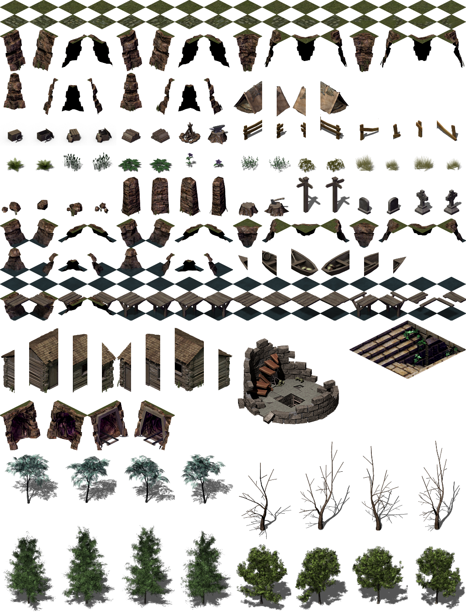 | 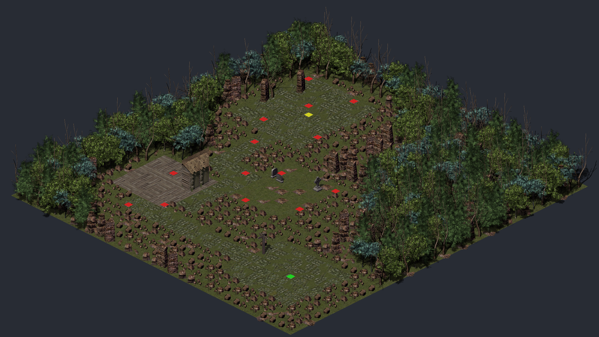 |
| AI agents slice and understand the tiles | Green: player spawn · Red: zombies · Yellow: exit |

> "Haunted graveyard: south entrance with signposts, gravestone-filled burial grounds among dead trees, a woodcutter's
> camp with campfire and logs to the west, and a stone boss arena in the north."

Type a prompt like this, optionally upload your own isometric spritesheets, and in about a minute you get:

* a standard **Tiled** isometric map (`level.tmj`) with web-safe tileset atlases,
* a typed **Flame (Dart) level loader** you can drop into your own game,
* a **verification report** (`summary.json`, 6 checks including `dart analyze` on the generated code),
* and a **Try Out** button that plays the level instantly in the browser (player, zombies with designed behaviors,
  health, exit).

---

## Why

Isometric levels are slow, manual work: slice spritesheets, tag every tile (floor? wall? walkable? anchor point?), paint
maps tile by tile, then write loader code. Asking a generative model for a raw tile grid does not work either: it drifts,
invents tiles that do not exist, and produces maps you cannot walk through.

This project splits the work: AI is used only where judgment matters (understanding art, planning a level, designing
enemy behavior). Everything that must be exact is deterministic code, and every level is validated before anyone
plays it.

## How it works: three pipelines

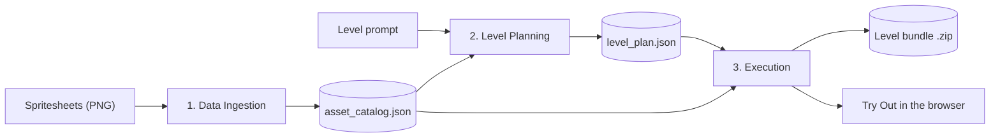

| | AI agents (judgment) | Algorithms (exactness) |
|---|---|---|
| **1. Data Ingestion** | Boundary, Classification, Collision, Entity agents; conflict arbitration | Tile size detection, slicing, merging, quality gate, cache |
| **2. Level Planning** | Topology Agent (room graph + style weights) | Layout, spawner, dressing, validator, retry loop |
| **3. Execution** | Enemy Mechanics Agent (behavior as data) | Tileset and map compilers, template code generator, verification |

### 1. Data Ingestion: any spritesheet becomes a semantic asset catalog

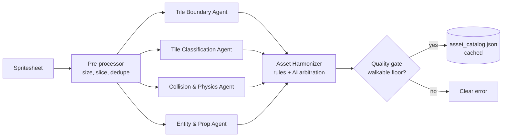

| Agent | Answers per tile |
|---|---|
| Tile Boundary | Floor tile, single object, multi-tile part, fragment, or noise; anchor check |
| Tile Classification | Category, material, family, walkable, edge connector |
| Collision & Physics | Blocks movement, blocks projectiles, height class |
| Entity & Prop | Character (excluded), interactive prop, editor marker |

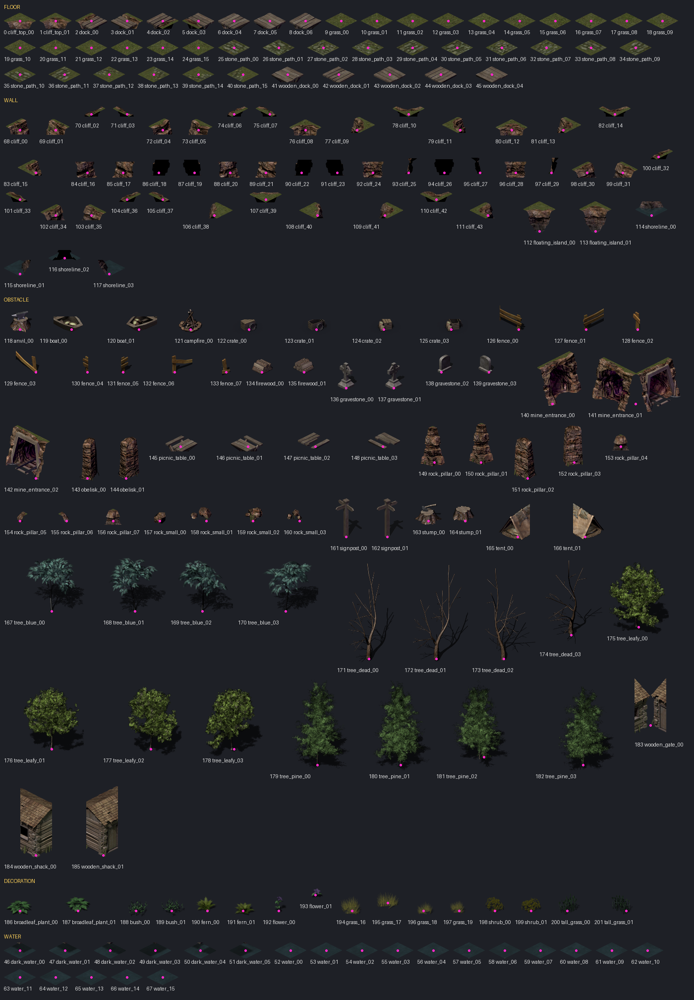

*A contact sheet of sliced, numbered tiles: this is what the vision agents see.*

* **Pre-processor (algorithm):** detects the base tile size (64×32, 128×64, 256×128, 32×16), scales to 64×32, slices
  sprites (contours with a grid fallback), removes noise and duplicates, builds contact sheets.
* **Four AI agents in parallel** (strict Pydantic schemas): Tile Boundary, Tile Classification, Collision & Physics,
  Entity & Prop.
* **Asset Harmonizer:** merges the answers in code with conflict rules; AI arbitration only for tiles where agents
  disagree; drops fragments, characters, and near-black void sprites.
* **Quality gate:** the sheet must contain a walkable floor. Results are cached by sheet content, so a known sheet costs
  no AI calls.

### 2. Level Planning: neuro-symbolic, with a self-healing loop (LangGraph)

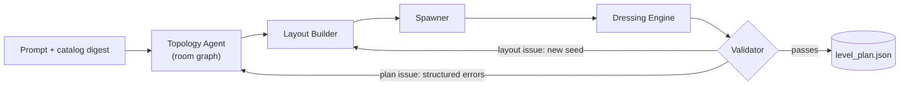

* **Topology Agent (AI):** turns the prompt plus a compact catalog digest into a **room graph** (rooms, purpose,
  direction, corridors, enemy counts, style weights). It never outputs tile arrays.
* **Algorithms:** layout builder (graph to exact isometric grid), spawner (player at the entrance, exit in the farthest
  room, zombies per room), dressing engine (style-weighted floors and prop clusters, a hedge that seals the level, camera
  clearance so tall sprites never hide the path).
* **Validator:** path from spawn to exit, every room reachable, entities on walkable cells, no escape routes. Failures go
  back as structured errors: layout issues retry with a new seed, plan issues go back to the agent.

### 3. Execution: a verified, portable level bundle

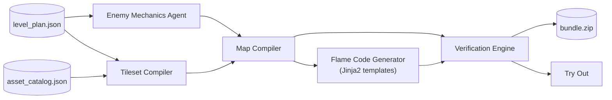

| Verification check | What it proves |
|---|---|
| `tmj_parses` | The Tiled map is valid JSON with the expected layers |
| `gids_resolve` | Every tile ID maps to a tile in an embedded tileset |
| `images_exist` | Every tileset image is in the bundle with the declared size |
| `atlas_fits` | All tilesets fit the 4096×4096 web texture atlas |
| `objects_on_walkable` | Player, zombies, and exit stand on walkable cells |
| `dart_analyze` | The generated `level_loader.dart` passes `dart analyze` |

| Zombie behavior (set by the AI per room) | In the game |
|---|---|
| `idle_until_near` | Waits until the player comes within its chase range |
| `patrol_room` | Walks around its room, chases the player in range |
| `guard_exit` | Stays near the exit unless the player comes close |

* **Enemy Mechanics Agent (AI):** zombie behavior per room (`idle_until_near`, `patrol_room`, `guard_exit`, chase range,
  speed), written as Tiled object properties. The AI never writes code.
* **Tileset and map compilers:** sprites grouped by size and anchor, atlases wrapped to fit the 4096×4096 web limit,
  embedded tilesets.
* **Template code generator (Jinja2):** a self-contained `level_loader.dart` with typed entity configs, an entity factory,
  and collision hitboxes.
* **Verification engine:** `tmj_parses`, `gids_resolve`, `images_exist`, `atlas_fits`, `objects_on_walkable`,
  `dart_analyze`.

Full design: [ARCHITECTURE.md](ARCHITECTURE.md).

## Examples

| Input | Result |
|---|---|
| Graveyard prompt, grassland sheet (example 1) | 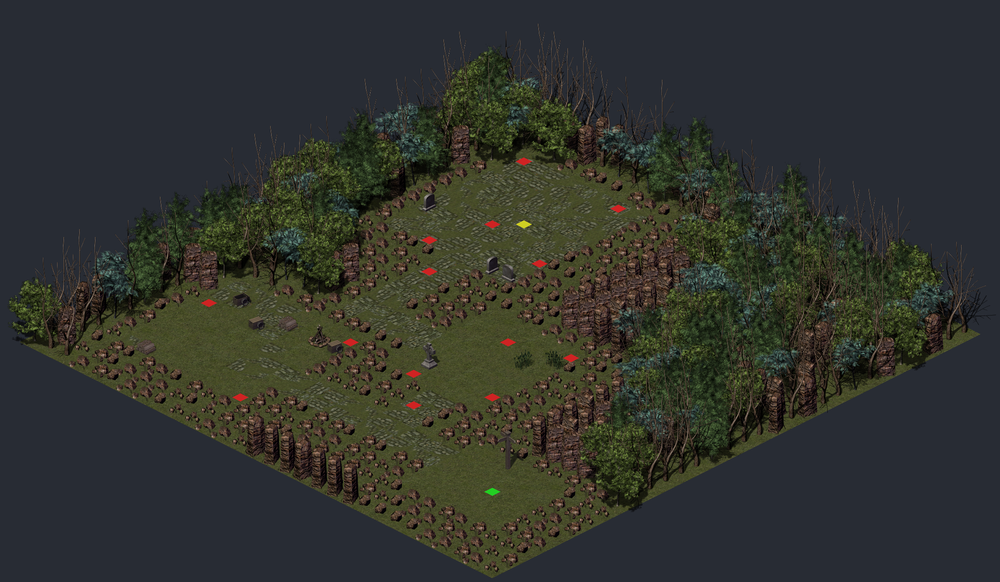 |
| Graveyard prompt, grassland sheet (example 2) | 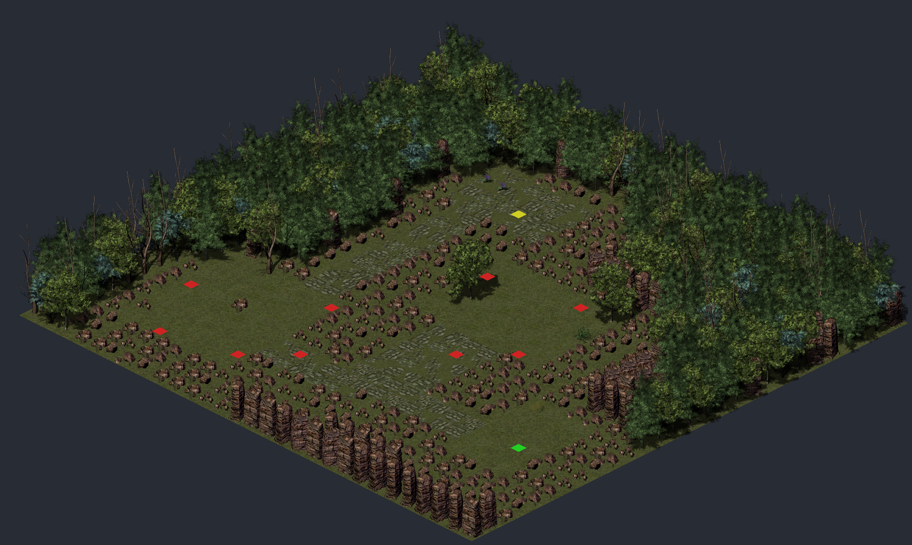 |
| Kenney farm and library sheets (uploaded) | 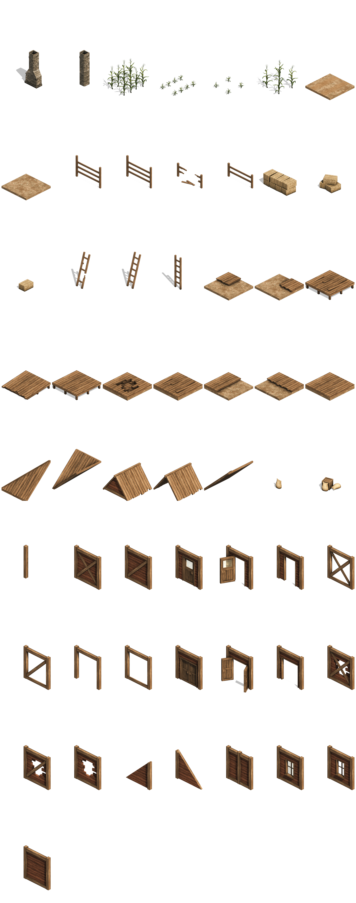 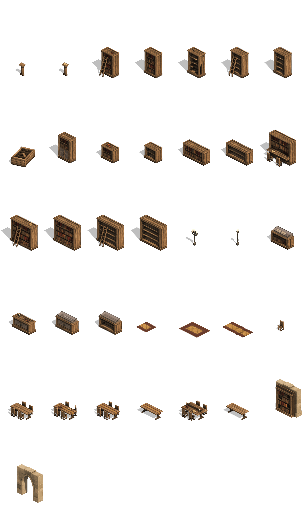 |

## Results

| Metric | Value |
|---|---|
| Pipeline 1 on the Flare grassland sheet (answer key) | category accuracy 98%, walkable accuracy 100%, chip recall 79% |
| Cold ingestion of a full sheet | about 41 AI calls, about 70 s; cached re-upload: 0 calls |
| AI calls per level (planning + mechanics) | 2 (plus retries only if validation fails) |
| Verification checks per bundle | 6 of 6 |
| Tests | 270+ backend (pytest, offline), 120+ Flutter |

## Tech stack

| Part | Technology |
|---|---|
| Frontend and game | Flutter web, Flame 1.38, flame_tiled |
| Backend | Python 3.12, FastAPI, LangGraph, Pydantic, OpenCV, Pillow, Jinja2 |
| AI agents | Gemini on Vertex AI through a small provider interface (structured output, retries, record/replay fixtures for offline tests) |
| Deployment | Google Cloud Run (backend, Docker image with the Flutter SDK for `dart analyze`), Vercel (static web build) |

## Repository layout

```
ARCHITECTURE.md                 System design, data contracts, API
backend/                        FastAPI app and the three pipelines
  app/                          API, jobs, asset packs
  pipeline/ingestion/           Pipeline 1 (pre-processor, agents, harmonizer)
  pipeline/planning/            Pipeline 2 (LangGraph graph, layout, spawner, dressing, validator)
  pipeline/execution/           Pipeline 3 (compilers, mechanics agent, codegen, verification)
  pipeline/llm/                 LLM provider interface and config
  tests/                        pytest suite (offline, recorded LLM responses)
  Dockerfile                    Cloud Run image
z_legend_game/z_legend_game_flutter/   Flutter web app: Level Designer screen and the Flame game
game-assets/                    Sample spritesheets, CREDITS.md, ASSET_SPEC.md
bob_sessions/                   One folder per development task: the prompt and the session summary
tools/                          Asset preparation scripts
```

## Run locally

Prerequisites: Flutter (stable), Python 3.12, [uv](https://docs.astral.sh/uv/), and a Google Cloud project with
Vertex AI enabled.

**Backend** (from `backend/`):
```bash
uv venv && uv pip install -r requirements.txt
uv run pytest                                   # offline tests
uv run uvicorn app.main:app --reload --port 8000
```
Create `.env` in the repository root (never commit it):
```
GOOGLE_CLOUD_PROJECT=<your-project>
GOOGLE_CLOUD_LOCATION=global
GOOGLE_GENAI_USE_VERTEXAI=true
GOOGLE_GENAI_MODEL=gemini-3.5-flash
GOOGLE_APPLICATION_CREDENTIALS=<path to a service account key>   # optional; unset = Application Default Credentials
```

**Frontend** (from `z_legend_game/z_legend_game_flutter/`):
```bash
flutter test
flutter run -d chrome                           # uses assets/config.json -> http://localhost:8000
```

## Deploy

* **Backend:** `docker build -f backend/Dockerfile -t <image> .` from the repository root, push, then deploy to Cloud Run
  with 1 instance (jobs run in-process), CPU always allocated, and a service account with `roles/aiplatform.user`.
  Set `CORS_ORIGINS` to the frontend URL.
* **Frontend:** `flutter build web --release --dart-define=API_URL=<cloud run url>`, then deploy `build/web` as a static
  site (for example `vercel deploy --prod`).

## How it was built: IBM Bob

Built for the **IBM Bob 2.0 Hackathon** with an orchestrator workflow: an orchestrator session wrote the architecture,
split the build into numbered tasks, and wrote one precise prompt per task; a coding agent implemented each task; the
orchestrator reviewed it with tests and browser checks.

* **IBM Bob** implemented tasks 01 to 05: character spritesheet conversion, the first slice of the Execution pipeline
  (tileset and map compilers with tests and a preview), removing Serverpod, asset path fixes, and the first playable
  Flame game.
* When the IBM Bob credits ran out during task 05, tasks 05 to 19 were continued with Claude Code using the same
  workflow.

Every prompt is in [`bob_sessions/`](bob_sessions/) (see its README for the task table).

## Credits and license

Code: [MIT](LICENSE). Sample art comes from OpenGameArt (Flare grassland and desert tilesets, CC-BY-SA 3.0) and Kenney
(CC0); the character sprites are licensed separately. See [game-assets/CREDITS.md](game-assets/CREDITS.md) for every
asset, its author, and its license terms.
