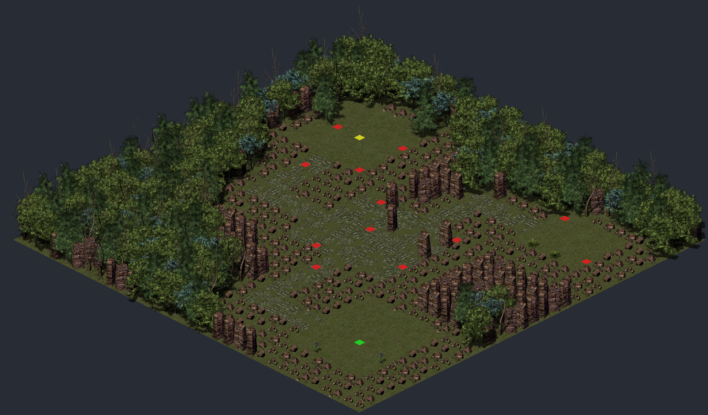
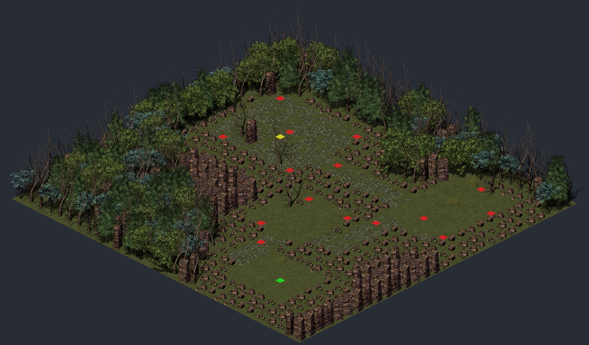
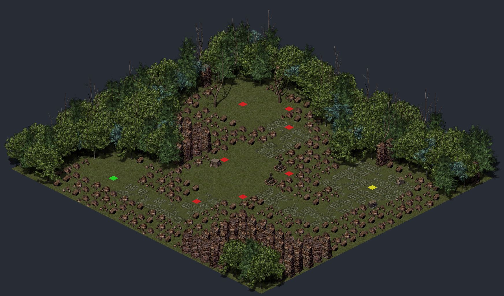

# Pipeline 2 evaluation: 5 prompts, `grassland_full`

Generated by `tools/evaluate_planner.py`. Each prompt runs the LangGraph planner
(`pipeline/planning/graph.py`): the LLM topology agent plans the room graph, deterministic
nodes lay it out, place entities, dress the tiles and validate. The level is then compiled
with Pipeline 3 for the preview (green: spawn, yellow: exit, red: zombies).
Model `gemini-3.5-flash`, LLM mode `record` (latency 0 in replay mode).

| # | Prompt | Valid | Matches prompt | Topology attempts | Layout attempts | LLM calls | Input tokens | Output tokens | Latency |
|---:|---|---|---|---:|---:|---:|---:|---:|---:|
| 1 | graveyard with a cabin and a boss arena | yes | 3/3 | 1 | 1 | 1 | 1821 | 2714 | 13.4 s |
| 2 | dense forest maze with a hidden treasure grove | yes | 4/4 | 1 | 1 | 1 | 1821 | 2394 | 12.4 s |
| 3 | open meadow with a stone plaza in the center guarded by 6 zombies | yes | 4/4 | 1 | 1 | 1 | 1827 | 2232 | 9.3 s |
| 4 | a winding path through dead trees to a boss clearing in the north | yes | 4/4 | 1 | 1 | 1 | 1826 | 1926 | 9.9 s |
| 5 | small campsite with firewood and a treasure room to the east | yes | 3/3 | 1 | 1 | 1 | 1824 | 2244 | 8.8 s |

## 1. "graveyard with a cabin and a boss arena"

**Judgement:** matches the prompt (3 of 3 checks).

- yes: gravestones in the rooms (4 gravestones)
- yes: a boss arena (r4)
- yes: a cabin (wood props or a cabin room) (5 wood props)

**Theme:** `graveyard_cabin`. **Design notes:** A linear progression from the foggy graveyard gates to an isolated undertaker's cabin, leading deeper into the main burial grounds and finally the massive stone boss arena. The layout ensures the boss arena is the furthest room from the entrance, automatically hosting the level exit.

| Room | Purpose | Position | Size | Enemies | Description |
|---|---|---|---|---:|---|
| r1 | entrance | south | small | 0 | The rusted iron gates of the old cemetery. A single signpost warns travelers to turn back. |
| r3 | puzzle | west | medium | 3 | The undertaker's cabin yard, littered with firewood, an old cart, and a smoldering campfire. |
| r2 | combat | center | medium | 5 | An overgrown burial plot choked with weeds and crumbling gravestones. |
| r4 | boss | north | large | 6 | A grand stone plaza surrounded by towering rock pillars where the graveyard's keeper awaits. |

**Corridors:** r1 -> r3 (winding), r3 -> r2 (straight), r2 -> r4 (straight)

**Style:** floor.grass 0.5, floor.stone 0.2, obstacle.tree_dead 0.15, decoration.dry_grass 0.15

**Map:** 30 x 31; exit in `r4`; 14 zombies.

**Attempts:** 1 topology, 1 layout. **Validation:** passed (ids_exist, entities_walkable, path_spawn_exit, rooms_reachable, boundary_integrity, rooms_layout).

**LLM:** 1 calls, 1 API attempts, 1821 input and 2714 output tokens, 13.4 s.

## 2. "dense forest maze with a hidden treasure grove"

**Judgement:** matches the prompt (4 of 4 checks).

- yes: a treasure room (r4)
- yes: maze-like: 4+ rooms or winding corridors (4 rooms, 2 winding corridors)
- yes: forest: trees in the rooms or most of the wilderness (3 trees in rooms, 41% of the wilderness)
- yes: treasure room is the exit (hidden at the end) (exit in r4)

**Theme:** `dense_forest_maze`. **Design notes:** Designed a 4-room linear maze structure that winds through a dense forest. The player starts at a quiet trailhead, fights through an overgrown thicket and a dead-tree path, and finally discovers the hidden treasure grove. Winding corridors enhance the maze feel, and the progression of dressings transitions from lush green to decaying woods, and finally to a serene, stone-paved flower grove.

| Room | Purpose | Position | Size | Enemies | Description |
|---|---|---|---|---:|---|
| r1 | entrance | south | small | 0 | A quiet forest trailhead marked by an old wooden signpost. |
| r2 | combat | center | medium | 4 | An overgrown thicket crawling with zombies hidden among the bushes. |
| r3 | combat | west | medium | 5 | A desolate, rocky path lined with dead trees where the forest maze grows dark. |
| r4 | treasure | north | small | 0 | A beautiful, hidden stone grove blooming with purple flowers and ancient secrets. |

**Corridors:** r1 -> r2 (straight), r2 -> r3 (winding), r3 -> r4 (winding)

**Style:** floor.grass 0.6, obstacle.tree_tall 0.2, obstacle.tree_fluffy 0.1, decoration.fern 0.1

**Map:** 29 x 28; exit in `r4`; 9 zombies.

**Attempts:** 1 topology, 1 layout. **Validation:** passed (ids_exist, entities_walkable, path_spawn_exit, rooms_reachable, boundary_integrity, rooms_layout).

**LLM:** 1 calls, 1 API attempts, 1821 input and 2394 output tokens, 12.4 s.

## 3. "open meadow with a stone plaza in the center guarded by 6 zombies"

**Judgement:** matches the prompt (4 of 4 checks).

- yes: a room in the center (r_plaza)
- yes: the center room is a stone plaza (100% stone floor in r_plaza)
- yes: 6 zombies at the plaza (6 zombies in or within 2 cells of the plaza)
- yes: open meadow: mostly grass floors outside the plaza (100% grass floor in the other rooms)

**Theme:** `open_meadow`. **Design notes:** This layout features a central stone plaza guarded by exactly 6 zombies, surrounded by lush green meadow rooms. The entrance starts in the south, leading directly into the central plaza, with side paths branching off to the north and east to encourage exploration.

| Room | Purpose | Position | Size | Enemies | Description |
|---|---|---|---|---:|---|
| r_entrance | entrance | south | medium | 0 | A peaceful grassy clearing where the journey begins. |
| r_plaza | combat | center | large | 6 | An ancient stone plaza standing in the center of the meadow, guarded by zombies. |
| r_meadow_east | treasure | east | small | 2 | A quiet eastern nook of the meadow with tall grass and hidden treasures. |
| r_meadow_north | boss | north | medium | 4 | The northern edge of the meadow, where the forest begins to thicken. |

**Corridors:** r_entrance -> r_plaza (straight), r_plaza -> r_meadow_east (winding), r_plaza -> r_meadow_north (straight)

**Style:** floor.grass 0.6, obstacle.tree_fluffy 0.15, decoration.flower 0.15, decoration.bush 0.1

**Map:** 32 x 32; exit in `r_meadow_north`; 12 zombies.

**Attempts:** 1 topology, 1 layout. **Validation:** passed (ids_exist, entities_walkable, path_spawn_exit, rooms_reachable, boundary_integrity, rooms_layout).

**LLM:** 1 calls, 1 API attempts, 1827 input and 2232 output tokens, 9.3 s.

## 4. "a winding path through dead trees to a boss clearing in the north"

**Judgement:** matches the prompt (4 of 4 checks).

- yes: boss room in the north (r4)
- yes: the exit is in the boss room (exit in r4)
- yes: winding corridors (3 winding)
- yes: dead trees (149 dead trees (the most common tree in the wilderness))

**Theme:** `withered_forest`. **Design notes:** Designed a winding path starting from the south, snaking through the center and east, and ending at a large boss clearing in the north. The global style heavily features dead trees and dry grass to match the withered forest aesthetic. Corridors are set to winding to emphasize the twisted path.

| Room | Purpose | Position | Size | Enemies | Description |
|---|---|---|---|---:|---|
| r1 | entrance | south | small | 0 | A quiet trailhead surrounded by decaying vegetation. |
| r2 | combat | center | medium | 4 | A dense cluster of dead oaks where zombies wander. |
| r3 | combat | east | medium | 5 | A narrow pass choked with withered branches and fog. |
| r4 | boss | north | large | 6 | The desolate northern clearing where the boss awaits. |

**Corridors:** r1 -> r2 (winding), r2 -> r3 (winding), r3 -> r4 (winding)

**Style:** floor.grass 0.4, obstacle.tree_dead 0.3, decoration.dry_grass 0.2, obstacle.rock_small 0.1

**Map:** 30 x 29; exit in `r4`; 15 zombies.

**Attempts:** 1 topology, 1 layout. **Validation:** passed (ids_exist, entities_walkable, path_spawn_exit, rooms_reachable, boundary_integrity, rooms_layout).

**LLM:** 1 calls, 1 API attempts, 1826 input and 1926 output tokens, 9.9 s.

## 5. "small campsite with firewood and a treasure room to the east"

**Judgement:** matches the prompt (3 of 3 checks).

- yes: campfire or firewood (2 campfires, 0 log stacks)
- yes: treasure room to the east (r_treasure)
- yes: small: at most 5 rooms, no large room (4 rooms, sizes small, medium, small, small)

**Theme:** `forest_campsite`. **Design notes:** This layout features a cozy but overrun campsite at its center, decorated with campfires and firewood logs. To the east lies a secure treasure room containing abandoned supplies, while the entrance starts in a quiet clearing to the west.

| Room | Purpose | Position | Size | Enemies | Description |
|---|---|---|---|---:|---|
| r_entrance | entrance | west | small | 0 | A quiet clearing at the edge of the forest. |
| r_camp | combat | center | medium | 4 | The main campsite, littered with firewood and overrun by zombies. |
| r_treasure | treasure | east | small | 0 | A hidden cache to the east, containing abandoned supplies and treasures. |
| r_guard | combat | north | small | 3 | A northern forest path guarded by lingering undead. |

**Corridors:** r_entrance -> r_camp (straight), r_camp -> r_treasure (straight), r_camp -> r_guard (winding)

**Style:** floor.grass 0.6, obstacle.tree_fluffy 0.2, decoration.fern 0.1, decoration.flower 0.1

**Map:** 27 x 25; exit in `r_treasure`; 7 zombies.

**Attempts:** 1 topology, 1 layout. **Validation:** passed (ids_exist, entities_walkable, path_spawn_exit, rooms_reachable, boundary_integrity, rooms_layout).

**LLM:** 1 calls, 1 API attempts, 1824 input and 2244 output tokens, 8.8 s.
